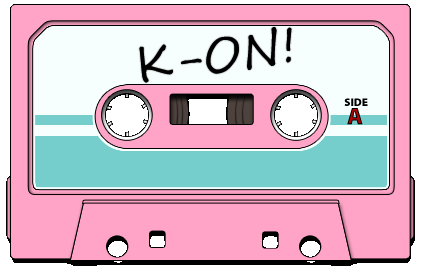

<!-- HELLO -->

# Hello, World!

    

        
    

    Uhmm <i>ano</i>... I guess I have to introduce myself. Hello ther... (<i>literally explodes</i>)

<!-- ABOUT ME -->

##  About Me

Yo! I'm a junior programmer embarking on his journey in the <i>Matrix</i> world.

Here are some personal and random facts about me since you're curious (if not, you probably have skipped this part).

<ul>
    <li> 👨‍💻 My name is William Oktavianus and most people usually call me William or simply Willy. </li>
    <li> 🏡 I live in Bandung, Indonesia. </li>
    <li> 🏫 I graduated from <a href="https://unpar.ac.id">Parahyangan Catholic University</a> in 2021 with a bachelor's degree in computer science. </li>
    <li> 💻 I am currently a fullstack web developer and a junior mobile developer. </li>
    <li> 👺 As you may have guessed already, I am a proud <i>weeb</i>. I watch a lot of anime and read some manga (<i>Ojamashimasu</i>—feel free to check out <a href="https://myanimelist.net/profile/coolcat082">my MAL account</a> if you're a fellow weeb.) </li>
    <li> 🎬 But anime’s not all—I love movies and series, old and new. If you're interested too, feel free to check out <a href="https://letterboxd.com/williamo1099">my Letterboxd profile</a>.</li>
    <li> 🎸 <b>Another fun fact about me&hellip;</b> I am obsessed with music. I play guitar in my spare time and love experimenting with a DAW. </li>
</ul>

<!-- TECHNOLOGIES AND TOOL -->

##  Technologies and Tools

For years, I have learned several programming technologies and tools to help advance my career as a programmer. Here are some of the technologies and tools I have learned and used so far.

<table>
    <tr>
        <th> Languages </th>
        <td>
            <!-- JavaScript -->
            
            <!-- PHP -->
            
            <!-- Java -->
            
            <!-- Python -->
            
            <!-- Dart -->
            
            <!-- Swift -->
            
        </td>
    </tr>
    <tr>
        <th> Frameworks </th>
        <td>
            <!-- Laravel -->
            
            <!-- CodeIgniter -->
            
            <!-- Flutter -->
            
            <!-- React Native -->
            
            <!-- React -->
            
            <!-- Tailwind CSS -->
            
        </td>
    </tr>
    <tr>
        <th> Web Servers </th>
        <td>
            <!-- nginx -->
            
            <!-- Apache -->
            
        </td>
    </tr>
    <tr>
        <th> Databases </th>
        <td>
            <!-- MySQL -->
            
            <!-- MSSQL -->
            
        </td>
    </tr>
    <tr>
        <th> Development Environments </th>
        <td>
            <!-- VSC -->
            
            <!-- XCode -->
            
            <!-- NetBeans -->
            
            <!-- Spyder -->
            
        </td>
    </tr>
    <tr>
        <th> Operating Systems </th>
        <td>
            <!-- MacOS -->
            
            <!-- Linux -->
            
            <!-- Windows -->
            
        </td>
    </tr>
    <tr>
        <th> ボーナス！ </th>
        <td>
            <!-- YouTube Music -->
            
        </td>
    </tr>
</table>

<!-- CONTACT -->

##  Contact

<i>If you need me, call me</i>—just like <a href="https://steveperry.com">Steve Perry</a> said, right? So never hesitate to contact me. Here are some platforms where you can reach me.

    <!-- Email -->
    
    
    <!-- LinkedIn -->
    

 

    

        
    

    <i>Nyaa</i>... see ya!

